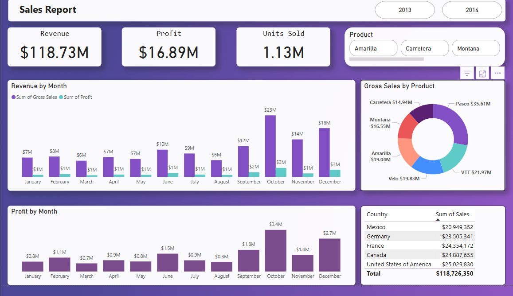

# Day_2

# **Power BI Sales Dashboard - README**

## **📌 Overview**  
This Power BI dashboard provides an interactive analysis of sales performance, revenue trends, and profitability across different product lines, cities, and branches. The visualizations help identify key business insights, such as top-selling products, regional performance, and profit margins.

---

## **📊 Dashboard Features**  
### **1. Key Metrics (KPIs)**  
- **Gross Income:** $15.4K  
- **Profit:** $15.4K  
- **Total Revenue:** $323.0K  
- **Units Sold:** 5.5K  

### **2. Interactive Filters**  
- **Module:** Toggle between "All" or filter by:  
  - **Product Line** (e.g., Food and beverages, Fashion accessories)  
  - **City** (e.g., Yangon, Mandalay)  

### **3. Visualizations**  
#### **Revenue Analysis**  
- **Revenue by Product Line**  
  - Top-performing categories (e.g., Food and beverages, Sports and travel).  
- **Revenue by City**  
  - Breakdown of sales across cities (e.g., Yangon, Mandalay).  
- **Revenue by City and Branch**  
  - Contribution of each branch to total revenue (e.g., 32.88% from Branch A).  

#### **Profitability Insights**  
- **Profit by Product Line**  
  - Highlights most profitable categories (e.g., Food and beverages: $3K).  

---

## **🔧 How to Use**  
1. **Filter Data:**  
   - Use the **Module** dropdowns to focus on specific product lines or cities.  
2. **Drill-Down:**  
   - Click on charts (e.g., bar graphs) to explore underlying transaction details.  
3. **Tooltips:**  
   - Hover over visuals to see additional metrics (e.g., profit margins).  

---

## **📂 Data Sources**  
- **Primary Dataset:** Contains columns like:  
  - `Invoice ID`, `Branch`, `City`, `Product line`, `Unit price`, `Quantity`, `Total`, `Profit`.  
- **Transformations Applied:**  
  - Calculated columns for `Profit` (`Total - cogs`).  
  - Aggregations for KPIs (e.g., `SUM(Revenue)`).  

---

## **🎨 Dashboard Preview**  
  

---

## **🚀 Future Enhancements**  
- Add **forecasting** for sales trends.  
- Include **customer segmentation** analysis.  
- Integrate **real-time data** refreshes.  

---

## **📜 License**  
MIT License. Free to use and modify.  

**🔗 Connect:**  
[GitHub Profile](https://github.com/gondanesiddhant) | [LinkedIn](https://www.linkedin.com/in/siddhant-gondane-590bb6185/)  
